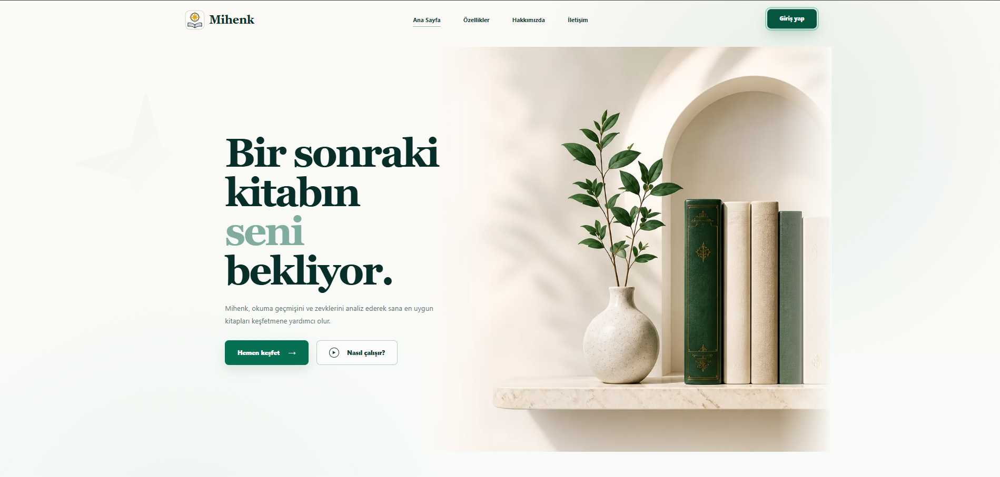

# Mihenk

<p align="center"></p>

Mihenk; kişiselleştirilmiş kitap önerileri, kitaplık yönetimi, okuma takibi,
alıntılar ve fiyat alarmları sunan bir web uygulamasıdır.

## Proje yapısı

```text
Mihenk/
├── backend/          # Python API, servisler, veritabanı ve testler
├── frontend/         # React / TypeScript arayüzü
├── infra/            # Docker Compose, Caddy ve n8n
├── docs/             # Rehberler ve görseller
├── .github/          # CI/CD iş akışları
├── Dockerfile        # Uygulama imajı
├── render.yaml       # Render dağıtımı
└── README.md
```

Git ve Docker'ın kullandığı üç gizli ayar dosyası da kökte bulunur.
[Ayrıntılı klasör rehberi](docs/project-structure.md).

## Geliştirme

Python 3.12 ve Node.js 22 kullanılır. Aşağıdaki iki komut grubu ayrı
terminallerde, depo kökünden başlatılır.

**Backend:**

```powershell
cd backend
python -m venv .venv
.venv\Scripts\Activate.ps1
python -m pip install -r requirements.lock.txt
uvicorn app.main:app --host 127.0.0.1 --port 8010
```

macOS/Linux üzerinde sanal ortamı `source .venv/bin/activate` ile etkinleştirin.
İsteğe bağlı yerel ayarlar için `backend/.env.example` dosyasını `backend/.env`
olarak kopyalayın.

**Frontend:**

```powershell
cd frontend
npm ci
npm run build
```

Derleme `backend/app/static/generated/` klasörüne yazılır.
Uygulama [localhost:8010](http://127.0.0.1:8010) adresinde açılır.

## Testler

Backend klasöründe `python -m pytest -q`, frontend klasöründe `npm test`
ve `npm run build` çalıştırılır. Uygulama açıkken frontend klasöründe
`npm run test:e2e` ile tarayıcı testleri çalıştırılır.

## Dağıtım ve kullanım

- [Dağıtım rehberi](docs/deployment.md)
- [Kayıt ve admin davetleri](docs/registration-and-invitations.md)
- [İşletim notları](docs/operations.md)

Docker imajı depo kökünden `docker build -t mihenk .` ile oluşturulur.
Render aynı kök `Dockerfile` dosyasını kullanır.

## Ekran görüntüsü


